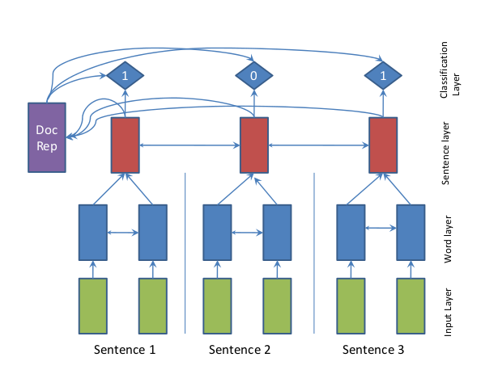
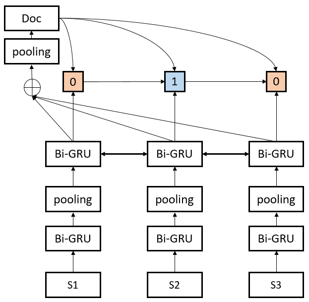
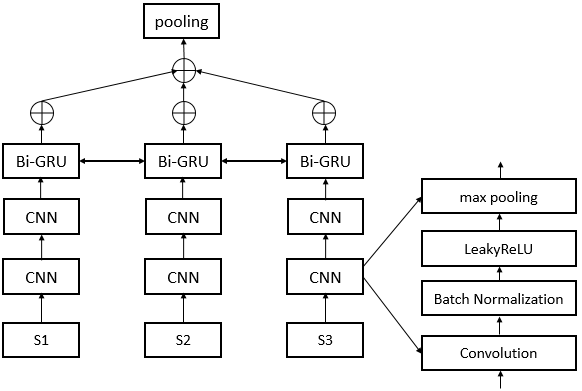
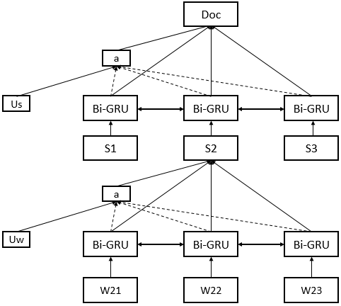

### Models

1. SummaRunner

2. RNN_RNN

3. CNN_RNN

4. Hierarchical Attention Networks

### Usage  

# train
python main.py -device 0 -batch_size 32 -model RNN_RNN -seed 1 -save_dir checkpoints/XXX.pt
# test
python main.py -device 0 -batch_size 1 -test -load_dir checkpoints/XXX.pt
# predict
python main.py -batch_size 1 -predict -filename x.txt -load_dir checkpoints/RNN_RNN_seed_1.pt
## pretrained models

1. RNN_RNN("checkpoints/RNN_RNN_seed_1.pt")
2. CNN_RNN("checkpoints/CNN_RNN_seed_1.pt")
2. AttnRNN("checkpoints/AttnRNN_seed_1.pt")

## Result

#### DailyMail/CNN Dataset  

| model  | ROUGE-1   | ROUGE-2 | ROUGE-L |
| ------ | :-----:   | :----:  | :----:  |
|SummaRNNer(Nallapati)|26.2|10.8|14.4|
|RNN-RNN|26.0|11.5|13.8|
|CNN-RNN|25.8|11.3|13.8|
|Hierarchical Attn Net|26.0|11.4|13.8|

### Download Data:  

+ Preprocessed data:[data.tar.gz](https://drive.google.com/file/d/1JgsboIAs__r6XfCbkDWgmberXJw8FBWE/view?usp=sharing)

+ Source Data:[Neural Summarization by Extracting Sentences and Words](https://docs.google.com/uc?id=0B0Obe9L1qtsnSXZEd0JCenIyejg&export=download)

### Evaluation

+ [Tools](https://github.com/hpzhao/nlp-metrics)
